Cross-Examination of Climate Vulnerability Index
================
Kendall Frimodig
08 June, 2021

### Objective

Climate change is expected to exacerbate medical emergencies which could
be triggered due to direct factors such as more frequent extreme
temperatures, or broader events such as winter storms or wildfires which
can compromise power grids and leave communities without the means for
heat or air conditioning

In light of these projections, which we have already began to see play
out (recent winter storm in Texas, Wildfires in California) health
departments at all levels of government have invested in developing
mitigation strategies for climate vulnerable communities. For this work
to be feasible, it is important to narrow down which regions are in most
need of investment.

The Climate Vulnerability Index developed by Tony Fristachi was intended
to rank communities of New Mexico based on the aggregation of numerous
factors lending to risk, such as socioeconomic or age characteristics.

The following program aims to cross examine the 22 small areas
identified as being most vulnerable, within the context of the
individual measures that make up the aggregate rank. A common practice
in the development of indices is ranking based on relevance - however
this weighting can often be arbitrary. Furthermore the quality of each
data point must be considered, as some measures are discretely collected
from every resident of the state, whereas others may be projected based
on survey samples.

As 22 small areas were identified as having a 5/5 vulnerability rank,
there remains a need for narrowing down the scope of future work.
Through the basic distributions one can see where each of these small
areas stands in terms of relevant measures.

### Packages used

Beeswarm is a package which produces a variation on a simple dot plot.
the algorithm used allows for a more continuous representation while
visualizing the overall distribution for a single measure well.

In order for the point-wise color and legend entries to function, a
proxy ‘list’ must be used - which must mirror the sort order of the
data-set plotted. This list must have a identical variable (values and
name) as the source data.

The string of hexadecimal colors for each of the 22 small areas must
also be sorted respectively.

### Visualizations

The first set of figures displays the 22 small areas individually within
distributions for each individual measure for the index.

The second set produces a collection of similar figures, but for each
small area individually. This is accomplished by integrating a loop
within the custom plot function, where the highlighting color is
inserted sequentially within the list of color strings.

``` r
  #install.packages("knitr")
  library(knitr)
  #install.packages("stringr")
  library(stringr)
  #install.packages("beeswarm")
  library("beeswarm")
  #install.packages("yarrr")
  library("yarrr")
  library(foreign)
  #install.packages("tidyverse")
  library(tidyverse)
```

### Importing from csv

``` r
datadir <- "./data"

    load(file.path(datadir,"exposure-dohsa.Rdata"))
    load(file.path(datadir,"healthcare-dohsa.Rdata"))
    load(file.path(datadir,"household-dohsa.Rdata"))
    load(file.path(datadir,"housing-dohsa.Rdata"))
    load(file.path(datadir,"minlang-dohsa.Rdata"))
    load(file.path(datadir,"overall-dohsa.Rdata"))
    load(file.path(datadir,"socio-dohsa.Rdata"))
```

### Working data sets

``` r
tmp <- overall_dohsa  %>% select(dohsa,overall_dohsa_rankings) %>%
      mutate(rank = ifelse(overall_dohsa_rankings==5,2,1))
    
    prepare <- function(i,...) {
      
        i %>% left_join(tmp, by="dohsa")  %>%
            mutate(sa = as.numeric(ifelse(rank==1,999,dohsa))) %>%
            arrange(sa) %>%  rownames_to_column(var="id") %>%
            mutate(id = as.numeric(id))  %>% ...
    }
    

  overall <-  prepare(overall_dohsa, select_all())
    
   exp <- prepare(exposure_dohsa, select_all())
   
    health <- prepare(healthcare_dohsa, select_all())
    
    household <- data.frame(prepare(household_dohsa, select_all()))
    
    housing <- prepare(housing_dohsa, select_all())
    
    racelang <- prepare(minlang_dohsa, select_all())
    
    socio <- prepare(socio_dohsa, select_all())

    temp  <- tmp %>% mutate(sa = as.numeric(ifelse(rank==1,999,dohsa))) %>%
      select(sa) %>% arrange(sa) %>%  rownames_to_column(var="id") %>%
      mutate(id = as.numeric(id)) %>% mutate(lis= ifelse(id>22,23,id))
    
    sa <- temp$lis
```

### Beeswarm function uno

``` r
  pallete.legend <- (c(
      "#d8c827",
      "#978c1b",
      "#27d8c8",
      "#6f27d8",
      "#175681",
      "#a8d2ef",
      "#974d1b",
      "#d86f27",
      "#ebb793",
      "#2790d8",
      "#efa8af",
      "#e36773",
      "#27d86f",
      "#178142",
      "#0b4021",
      "#d3f7e2",
      "#d82738",
      "#c827d8",
      "#7d87e7",
      "#bec3f3",
      "#811721",
      "#400b10",
      "#cccccc"))
    
    
      
    he.dist <- function(x,...) {
      
      require(graphics)
      
      palette(c(
        "#d8c827",
        "#978c1b",
        "#27d8c8",
        "#6f27d8",
        "#175681",
        "#a8d2ef",
        "#974d1b",
        "#d86f27",
        "#ebb793",
        "#2790d8",
        "#efa8af",
        "#e36773",
        "#27d86f",
        "#178142",
        "#0b4021",
        "#d3f7e2",
        "#d82738",
        "#c827d8",
        "#7d87e7",
        "#bec3f3",
        "#811721",
        "#400b10",
        "#cccccc"))
     
      
    par(mar = c(5, 4, 4, 8),                                  
    xpd = TRUE) 
      
      beeswarm(x,method="center", spacing=1.5, pch=16, horizontal=FALSE,cex.main=0.5,cex=1,
               
               pwcol= sa, col=pallete.legend, bty='n', cex.lab=0.5, cex.axis=0.5,
               
               xaxt = "n", bg="grey",
               
               ...)
      
      legend("topright",inset = c(- 0.3, 0), legend = c(
                                      "Bernalillo County, Central Penn",
                                      "Bernalillo County, Arenal Tapia",
                                      "Chaves County, Roswell N.W.",
                                      "Cibola County",
                                      "Colfax/Union Counties",
                                      "Curry County, Clovis West",
                                      "Dona Ana County, Anthony Berino Chaparral",
                                      "Dona Ana County, Sunland Park",
                                      "Dona Ana County, South Las Cruces",
                                      "Hidalgo County/Grant County, Other",
                                      "Lea County, Hobbs So.",
                                      "Luna County",
                                      "McKinley County, Gallup",
                                      "McKinley County, NW",
                                      "McKinley County, SW",
                                      "McKinley County, Other",
                                      "San Miguel County, Las Vegas",
                                      "Roosevelt County/Curry County, Other",
                                      "San Juan County, South",
                                      "San Juan County, West",
                                      "Sandoval County Other West",
                                      "Socorro County",
                                      "All Other Small Areas"),

               title = "22 Small Areas with Highest CVI Rank", pch = 16,  bty='n', cex=0.5, pt.cex=0.7, col=pallete.legend )
      
      
      abline(h = mean(x,na.rm=TRUE),
             lty = 2)  
    }
    
    
    
```

``` r
    
    par(bg = gray(.9))
  

    he.dist(socio$poverty_pct*100, main="Percent Living Below Federal Poverty Level", ylab="%")
```

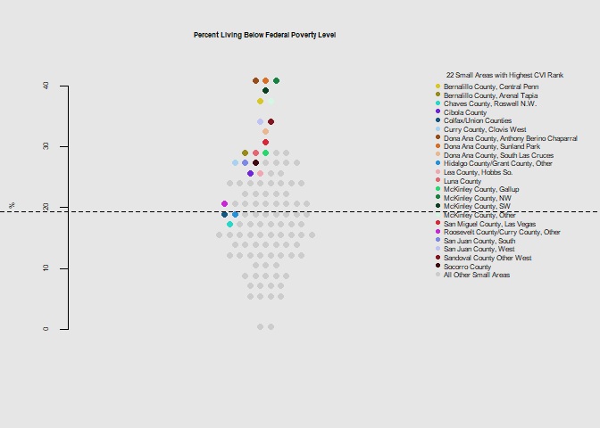<!-- -->

``` r
    he.dist(socio$unemployed_pct*100, main="Percent Unemployed", ylab="%")
```

<!-- -->

``` r
    he.dist(socio$income, main="Per-Capita Income 2016", ylab="$")
```

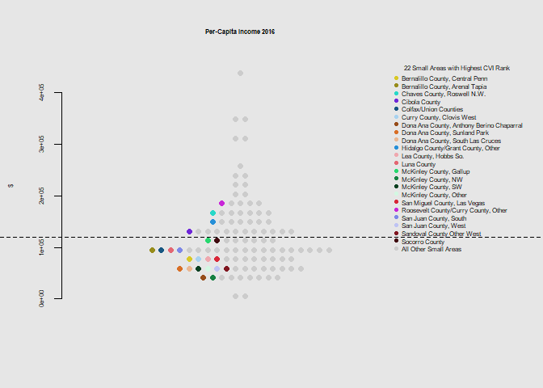<!-- -->

``` r
    he.dist(socio$nodiploma_pct, main="Percent 25 or Older Without HS Diploma", ylab="%")
```

<!-- -->

``` r
    he.dist(socio$socio_dohsa_rank, main="Overall Socioeconomic Rank", ylab="")
```

<!-- -->

``` r
    he.dist(health$distance_dohsa, main="Distance to a Healthcare Facility", ylab="")
```

<!-- -->

``` r
    he.dist(health$uninsured_dohsa_pct*100, main="Percent of Individuals Under 65 without Insurance", ylab="%")
```

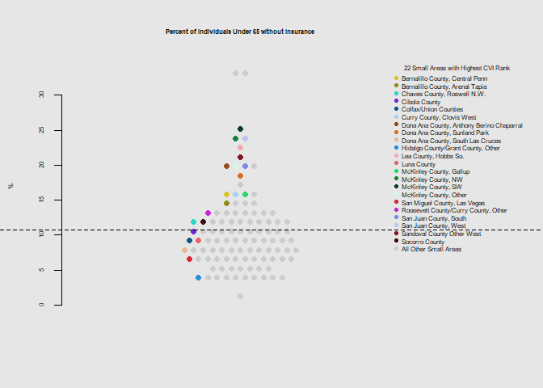<!-- -->

``` r
    he.dist(health$healthcare_dohsa_rank, main="Overall Healthcare Access Rank", ylab="")
```

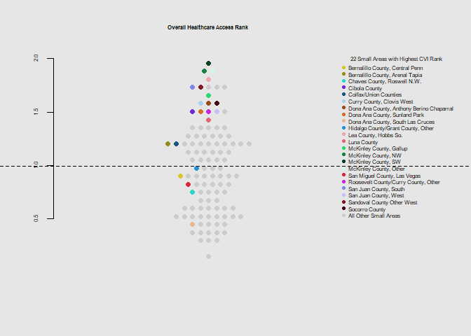<!-- -->

``` r
    he.dist(housing$munit_pct*100, main="% of Buildings with 10 or Greater Units", ylab="%")
```

<!-- -->

``` r
    he.dist(housing$mobile_pct*100, main="Percent Mobile Homes", ylab="%")
```

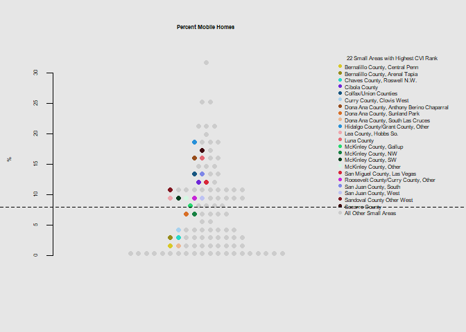<!-- -->

``` r
    he.dist(housing$novehicle_pct*100, main="Percent of Households Without Vehicle", ylab="%")
```

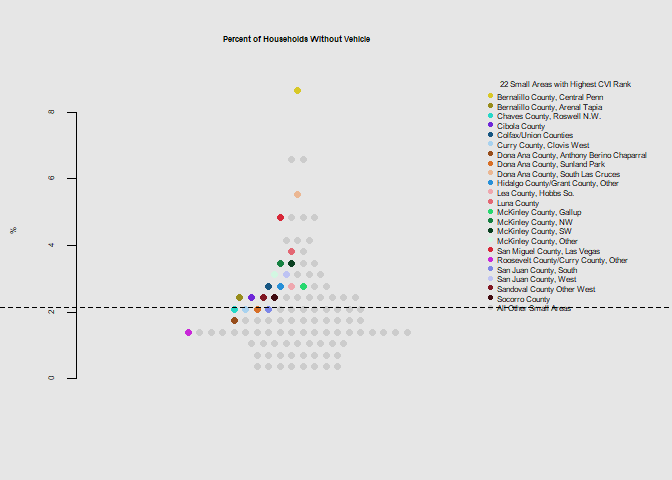<!-- -->

``` r
    he.dist(housing$group_pct*100, main="Percent of People Living in Group Quarters", ylab="%")
```

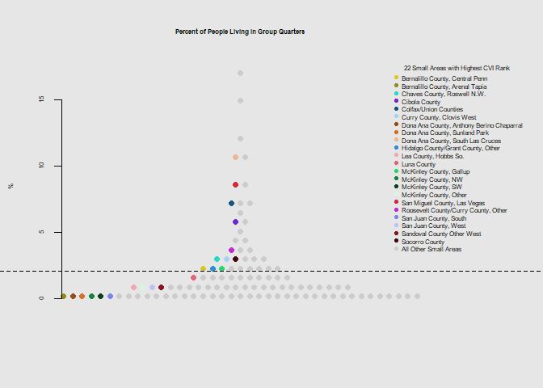<!-- -->

``` r
    he.dist(housing$crowd_pct*100, main="Percent of Housing Units with More Than 1 Person per Room", ylab="%")
```

<!-- -->

``` r
    he.dist(housing$housing_dohsa_rank, main="Overall Housing & Transportation Rank", ylab="")
```

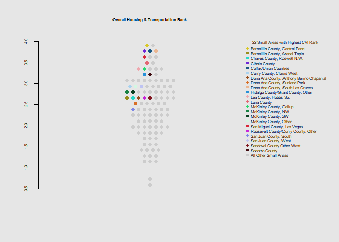<!-- -->

``` r
    he.dist(exp$hri_dohsa, main="Heat Related Illness ED visits per 100,000", ylab="rate")
```

<!-- -->

``` r
    he.dist(exp$dohsa_days, main="Number of Extreme Heat Days (> 90 Degrees)", ylab="days")
```

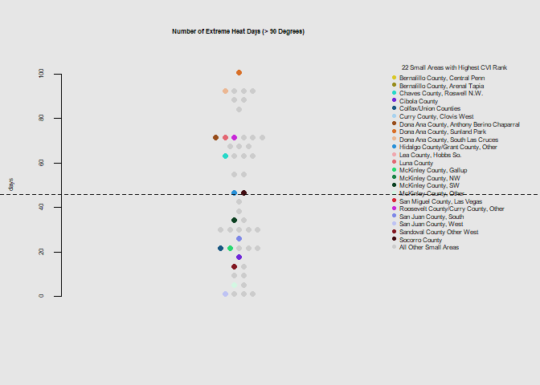<!-- -->

``` r
    he.dist(exp$drought_dohsa_weeks, main="Weeks in Severe Drought (10 year average)", ylab="weeks")
```

<!-- -->

``` r
    he.dist(exp$exposure_dohsa_rank, main="Overall Exposure Rank", ylab="")
```

<!-- -->

``` r
    he.dist(racelang$minority_pct*100, main="Percent Hispanic or Non-White", ylab="%")
```

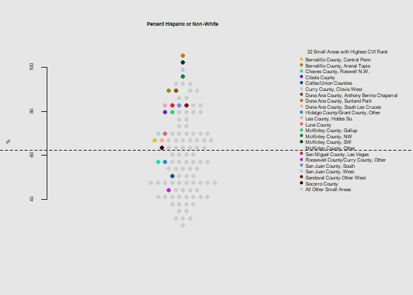<!-- -->

``` r
    he.dist(racelang$language_pct*100, main="Percent Limited English", ylab="%")
```

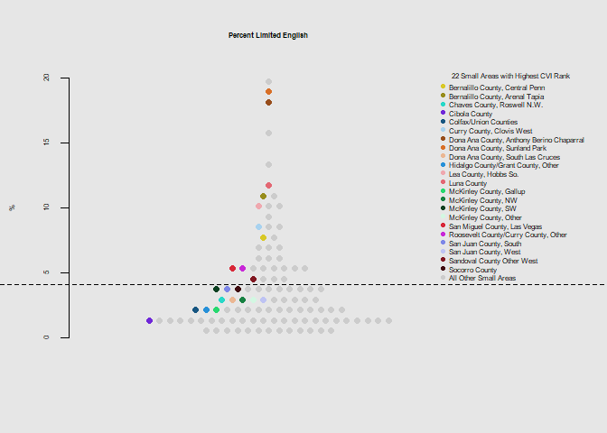<!-- -->

``` r
    he.dist(racelang$minlang_dohsa_rank, main="Overall Race/Language Rank", ylab="")
```

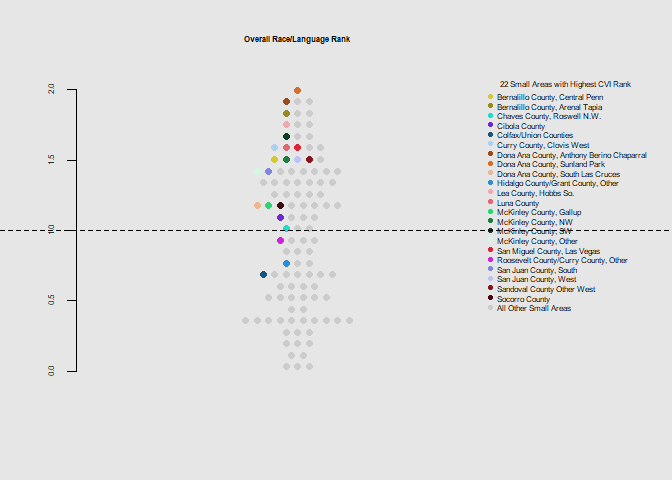<!-- -->

``` r
    he.dist(household$age65_pct*100, main="Percent Age 65+", ylab="%")
```

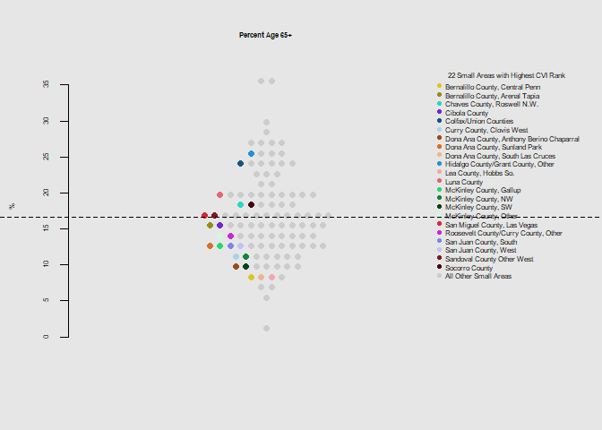<!-- -->

``` r
    he.dist(household$disabled_pct*100, main="Percent Disabled", ylab="%")
```

<!-- -->

``` r
    he.dist(household$singleparent_pct*100, main="Percent Households with Single Parent", ylab="%")
```

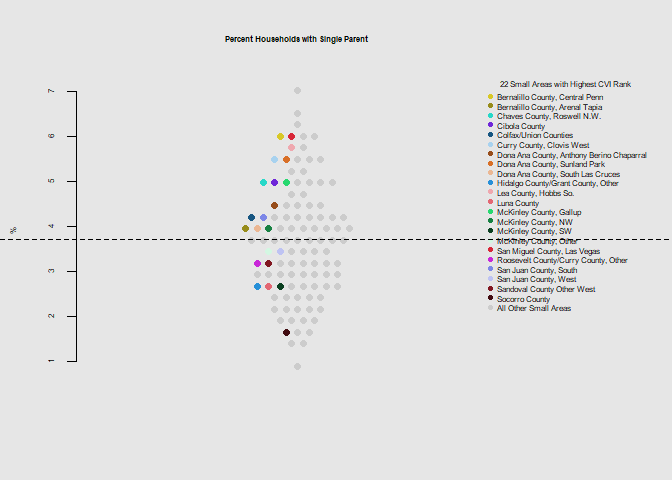<!-- -->

``` r
    he.dist(household$age17_pct*100, main="Percent age 17 or younger", ylab="%")
```

<!-- -->

``` r
    he.dist(household$household_dohsa_rank, main="Overall Household Rank", ylab="")
```

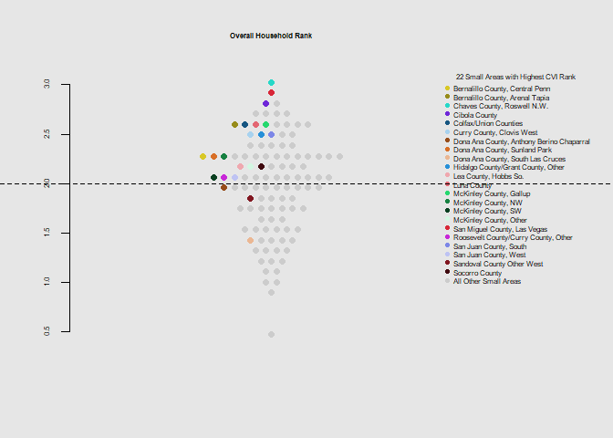<!-- -->

### Interpretations

Notably the 12 small areas with the highest poverty level were among
those with the highest overall climate vulnerability rank. 19 of 22 were
below the state mean for the education metric, and overall had above
average levels for disability, crowded housing, and below average levels
for health insurance coverage, and vehicle access.

As the 22 identified small areas often rank worse than the state average
for individual climate vulnerability indicators, the index appears to
characterize the overall risk well. Despite this many small areas not
highlighted have particularly high heat related outcomes and elderly
populations, and analysis of these for similarly high values in the
other index components may lead to further considerations.

The small areas of the northwest and south (McKinley, San Juan, Dona Ana
Counties) appear to stand out as having poor health care access, high
poverty levels, and crowded or mobile housing.

As 22 small areas were identified as having a 5/5 vulnerability rank,
there remains a need for narrowing down the scope of future work.
Through the basic distributions one can see where each of these small
areas stands in terms of relevant measures, however these estimates are
in some cases derived from groupings of census tracts and cover large
areas.
